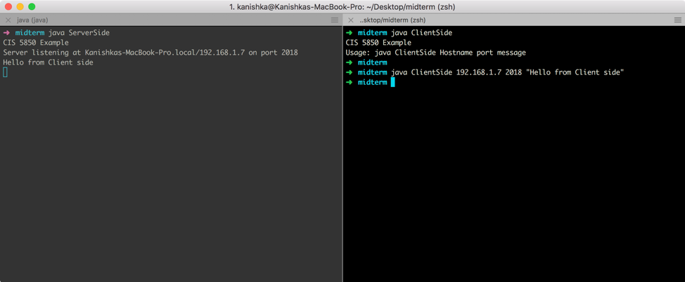
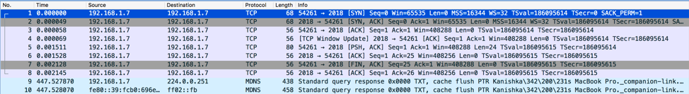
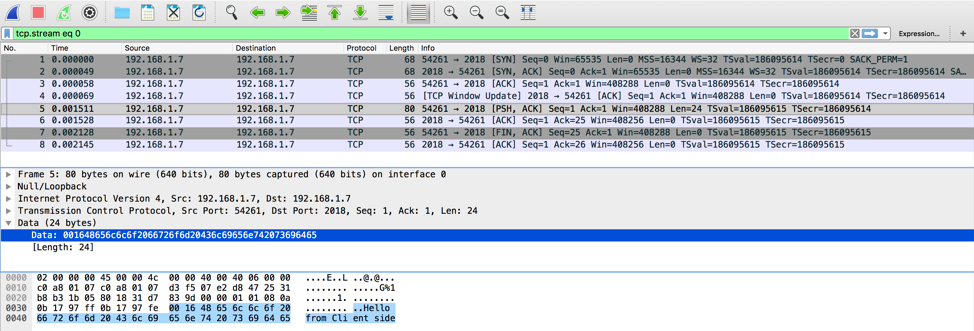
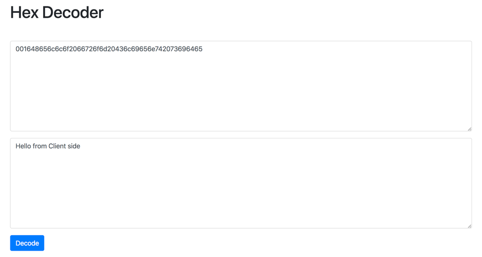

#### Program Trace

###### ServerSide.java

This program is a JAVA class which created a socket using the `java.net` module on the port `2018`. Socket is just a combination of the port and the IP address. If the socket creation is successful then the socket starts accepting connections from the client. Then an object of the `DataInputStream` is created. A data input stream lets an application read primitive Java data types from an underlying input stream in a machine-independent way. As `UTF-8` (Unicode) is the superset of all character sets, this is used to read input from the input stream. Ones the message is received, it is printed out to the console. There is explicit error handling also implemented. In JAVA exceptions class is inherited from java.lang.Exception.

###### ClientSide.java

This program is a JAVA class which begins by checking if there are 3 arguments while executing the program. If not, then the program exists by displaying the usage of the program. If the correct arguments are provided while running the program then these arguments are parsed appropriately. As JAVA treats all its command line arguments as strings, the port number has to be type casted to an integer. Ones the arguments are properly parsed then the connection is established using sockets. Then an object of the `DataOutputStream` is created. A data output stream lets an application write primitive Java data types to an output stream in a portable way. An application can then use a data input stream to read the data back in. The message is written to the stream. There is explicit error handling also implemented. In JAVA exceptions class is inherited from `java.lang.Exception`.

  
By tracing the communication using Wireshark and sniffing traffic on the loopback interface as both the server and the client are running on the same machine, it is evident that the traffic is TCP and there is a proper 3-way handshake happening between the client and the server. From the image below the first 3 packets depict the 3-way handshake i.e. `SYN`, `SYN-ACK` and `ACK`.

The 4th packet is a TCP Window Update packet which indicated that the sender's TCP buffer space has increased as the server is ready to receive data. The 5th packet is where the client is sending data to the server. 

In the image the hex representation of the data sent by the client to the server is show. In the bottom window the ASCII representation is also shown. This can be cross verifies by the using a hex decoder.
 

Ones the data is received the connection is closed by sending the packets with the flag `FIN-ACK` by the client and `ACK` by the server.